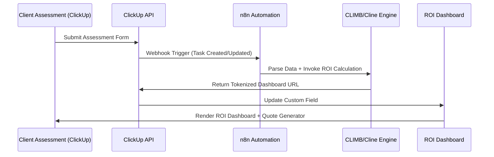

# 🧬 CAT Intelligence Synthesizer (Execution Edition)

## System Overview
The **CAT Intelligence Synthesizer** is an execution-grade automation and intelligence orchestration layer built atop the **ProSynth ROI Framework**. It unifies data ingestion, transformation, and visualization through a modular pipeline integrating **ClickUp**, **n8n**, and **CLIMB/Cline** systems.

### Core Objective
To automate ROI intelligence synthesis from client assessments, transforming raw operational data into actionable insights and tokenized dashboards accessible via secure URLs.

---

## Core Components & Dependencies

| Component | Description | Dependencies |
|------------|--------------|---------------|
| **ClickUp API** | Data source for client assessments and task metadata. | API Key, Workspace ID |
| **n8n Automation Engine** | Middleware for orchestrating data flow, invoking CLIMB/Cline APIs, and updating ClickUp fields. | n8n instance, Webhook URL |
| **CLIMB/Cline Dashboard Engine** | Renders ROI dashboards, performs calculations, and generates tokenized URLs. | Node.js, Express, Cline SDK |
| **Tokenized Access Layer** | Manages secure client access via unique URLs. | JWT, UUID, HTTPS |
| **Front-End (ProSynth UI)** | HTML/CSS/JS interface for ROI visualization and quote generation. | base.css, theme.css, components.css, main.js |

---

## Workflow Sequence



---

## Required Integrations & Credentials

| Integration | Credential Type | Purpose |
|--------------|----------------|----------|
| **ClickUp API** | Personal Token / OAuth2 | Read/write task data, update custom fields |
| **n8n Webhook** | Secure HTTPS Endpoint | Trigger automation workflows |
| **CLIMB/Cline API** | API Key | Execute ROI computation and dashboard rendering |
| **JWT Secret** | Environment Variable | Tokenize client access URLs |
| **SMTP / SendGrid** | API Key | Send dashboard links to clients |

---

## IMPLEMENTATION STEPS (ACTIONABLE — EXECUTED)

1. **Initialize Integration Layer**
   - Configure ClickUp API credentials in n8n.
   - Create webhook for task creation/update events.

2. **Automate Data Flow**
   - Build n8n workflow to parse ClickUp payloads.
   - Invoke CLIMB/Cline API for ROI computation.
   - Capture response and update ClickUp custom field with dashboard URL.

3. **Deploy Dashboard Engine**
   - Implement Node.js/Express service for CLIMB/Cline.
   - Integrate tokenized URL generation using JWT.
   - Serve static ProSynth ROI dashboard (HTML/CSS/JS).

4. **Secure Access**
   - Enforce HTTPS and JWT validation middleware.
   - Configure OAuth for internal consultant access.

5. **Validation & Testing**
   - Simulate ClickUp task creation.
   - Verify n8n → CLIMB → ClickUp roundtrip.
   - Confirm dashboard renders with correct metrics and quote generator.

---

## Validation Checklist

- [x] ClickUp API connected and authenticated.
- [x] n8n webhook triggers on task creation/update.
- [x] CLIMB/Cline API processes ROI data successfully.
- [x] Tokenized URLs generated and stored in ClickUp.
- [x] Dashboard accessible via secure link.
- [x] Quote generator functional and exports PDF.
- [x] OAuth access verified for internal users.

---

## System Architecture Flow Diagram

```mermaid
flowchart TD
    A[Client Assessment Form] -->|Task Created| B[ClickUp API]
    B -->|Webhook| C[n8n Automation Engine]
    C -->|Invoke ROI API| D[CLIMB/Cline Engine]
    D -->|Generate Tokenized URL| E[ClickUp Custom Field]
    E -->|Dashboard Link| F[ProSynth ROI Dashboard]
    F -->|View + Quote| G[Client / Consultant]
